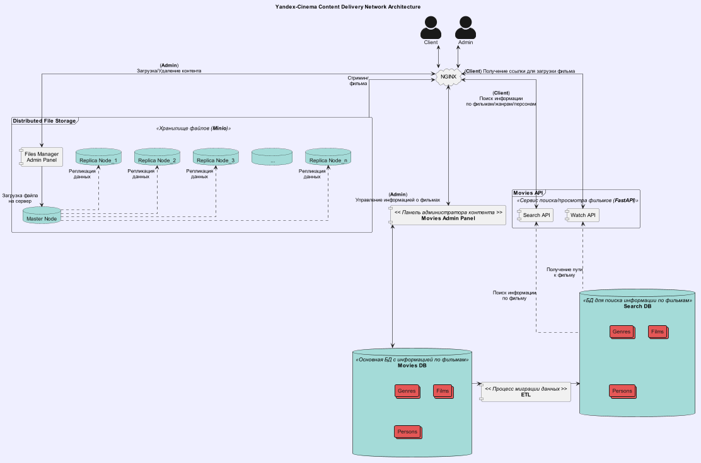

[//]: # (![Project CI]&#40;https://github.com/ghostrepo0/notifications_service/actions/workflows/python.yml/badge.svg&#41;)
# Распределённое хранение файлов

Дипломный проект в рамках курса Yandex.Practicum "Мидл-Python"

## Описание сервиса

Сервис распеределенного хранения файлов построен на базе объектного хранилища данных [MinIO](https://min.io/docs/minio/container/index.html).
Так, помимо 'мастер-ноды', на которую непосредственно загружаются фильмы, в рамках сервиса поднимаются дополнительно сервера на которые
производится [репликация](https://min.io/docs/minio/container/administration/bucket-replication.html) данных с помощью встроенного функционала.

Скрипт по настройке реплицирования находится в папке `./docker/minio`.

В данной реализации используется мастер-сервер с одной репликой.

Получение ссылки на просмотр фильма реализованно по следующему алгориму:
1. Клиент обращается к сервису **"MoviesAPI"** с *uuid* фильма для просмотра;
2. Исходя из локации пользователя (*IP_Address*) определяется ближайшая нода, и к ней формируется ссылка на получение фильма, которая имеет установленный срок, после которого она перестает работать;
3. Клиент перенаправляется по ней для просмотра фильма.

## Архитектура сервиса



## Развертывание проекта

### Окружение

Все переменные окружения находятся в соответствующих файлах в директории `./env/`.

Пароль от суперюзера панели администратора:

    username: 'test'
    email: 'test@test.com'
    password: qwe123

### Запуск прокета

```bash
$ make compose-up
$ make migrate-admin-fake
$ make migrate-admin
$ make collectstatic-admin
$ make make_superuser-admin
```

### Остановка проекта
```bash
$ make compose-down
```

## Ресурсы

### **"MoviesAPI"** (fastapi_service)

    http://127.0.0.1/api/openapi - документация
    http://127.0.0.1/ или http://localhost/

### **Admin_Panel** (movies-admin-panel)
    http://127.0.0.1/admin/ - панель администратора контента

### **MinIO** (minio storage)
    http://127.0.0.1:9001 - панель управления мастер-нодой
    http://127.0.0.1:9003 - панель управления репликой
